# AI Orchestration Architecture: Smart Customer Service with RAG

This project demonstrates how to build a sophisticated AI Customer Service platform using the **RAG (Retrieval-Augmented Generation)** pattern and a modern **AI Gateway** approach.

## Table of Contents
- [1. What is Chatbot AI RAG?](#1-what-is-chatbot-ai-rag-a-customer-service-story)
- [2. Architecture & Technical Approach](#2-architecture--technical-approach)
- [3. Step-by-Step Implementation](#3-step-by-step-implementation)
  - [Step 1: Environment Orchestration with Docker](#step-1-environment-orchestration-with-docker)
  - [Step 2: Configuring the AI Brain (Google Gemini)](#step-2-configuring-the-ai-brain-google-gemini)
  - [Step 3: Knowledge Base Ingestion](#step-3-knowledge-base-ingestion)
  - [Step 4: The LiteLLM AI Gateway Management](#step-4-the-litellm-ai-gateway-management)
  - [Step 5: End-to-End Chat & RAG Validation](#step-5-end-to-end-chat--rag-validation)
  - [Step 6: Database Persistence (History & Memory)](#step-6-database-persistence-history--memory)

---

## 1. What is Chatbot AI RAG? (A Customer Service Story)

In a traditional setup, an AI model relies only on the data it was trained on. This leads to problems when customers ask about *your* specific, private business data.

- **The Problem**: A standard AI might guess or "hallucinate" when asked about your latest pricing or support policies because it doesn't have access to your internal files.
- **The RAG Solution**: Before the AI answers a user, it first searches through your company's documents (PDFs, text files, databases). It finds the most relevant information and uses it as "context" to generate a precise answer.

Think of it as giving your AI agent an "open book" test. Instead of answering from memory, it looks up the facts in your manual first, ensuring 100% accuracy for your online customer service.

## 2. Architecture & Technical Approach

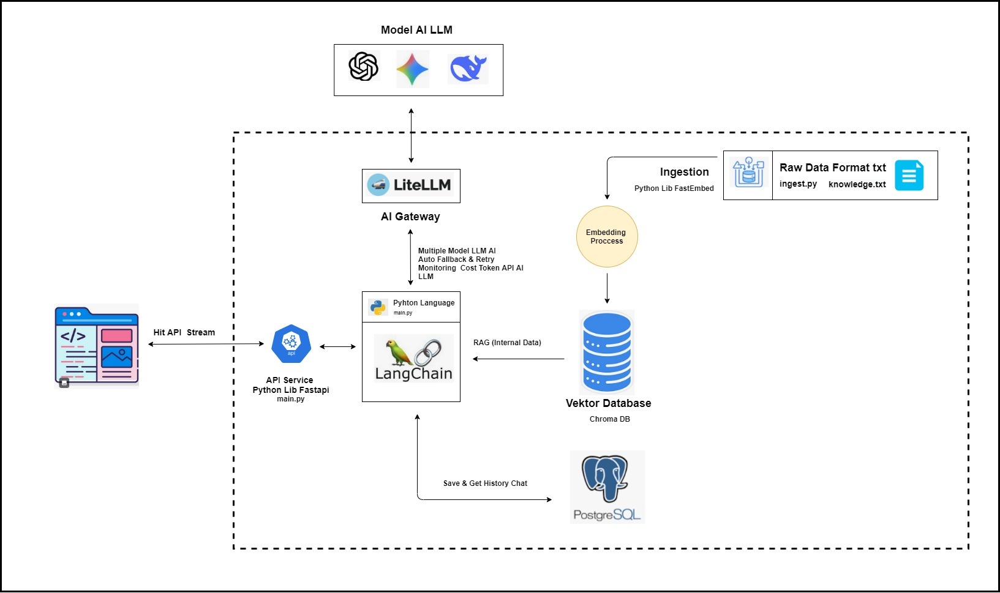

### Core Components:
1.  **AI Gateway (LiteLLM)**: We use LiteLLM to orchestrate multiple LLM providers. This acts as a single entry point for all AI requests. It provides advanced features like **load balancing**, **failover** (switching to OpenAI if Gemini is down), and **cost tracking**.
2.  **Local Knowledge Ingestion (FastEmbed)**: To keep the system fast and cost-effective, we use FastEmbed to convert our text data into mathematical vectors. This process happens locally within the application container.
3.  **Vector Store (ChromaDB)**: We store our knowledge vectors in ChromaDB. This database allows us to perform "semantic search," finding information that matches the *meaning* of a user's question rather than just matching keywords.
4.  **Retrieval Engine**: When a user asks a question, our FastAPI backend queries ChromaDB to find the top 3 most relevant snippets of information.
5.  **Contextual Generation (Gemini 1.5 Flash)**: We send the retrieved snippets along with the user's question to the Gemini model. This ensures the AI's response is strictly grounded in our provided data.
6.  **Conversation Memory (PostgreSQL)**: To handle multi-turn conversations, we store the full chat history in a Postgres database. This allows the AI to maintain context over long support sessions.

---

## 3. Step-by-Step Implementation

### Step 1: Environment Orchestration with Docker
The entire stack—including the AI Gateway, Database, and Main App—is managed through Docker Compose. This ensures that every developer and production environment is identical.

#### 1. Docker Running
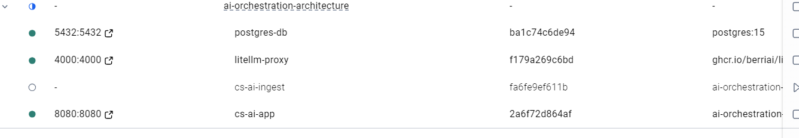
In this view, we can see the successful initialization of our three core services: 'litellm-proxy', 'postgres-db', and 'cs-ai-app'. Monitoring these containers is crucial because it confirms that our networking and environment variables are correctly configured, allowing the components to communicate via internal hostnames.

---

### Step 2: Configuring the AI Brain (Google Gemini)
We use Google's Gemini 1.5 Flash as our primary "reasoning engine" due to its high speed and low latency, which is perfect for a responsive customer service experience.

#### 2.1 Gemini Project Setup
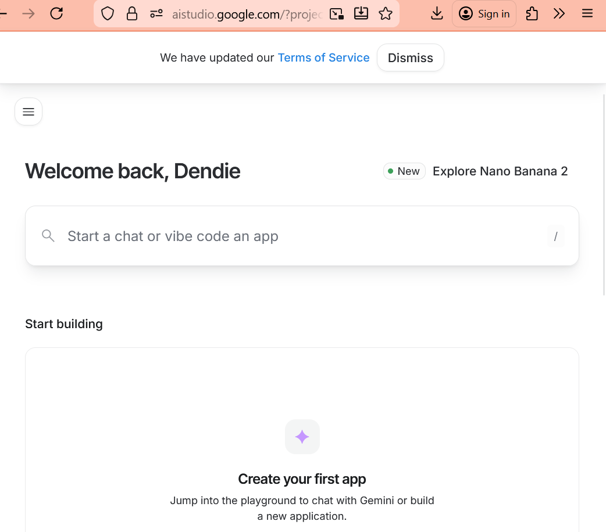
Our first step in the Google AI Studio is creating a new project. This workspace is where we manage our models and prepare to generate the secret API key that will bridge our local application with Google's massive AI infrastructure.

#### 2.2 API Key Generation
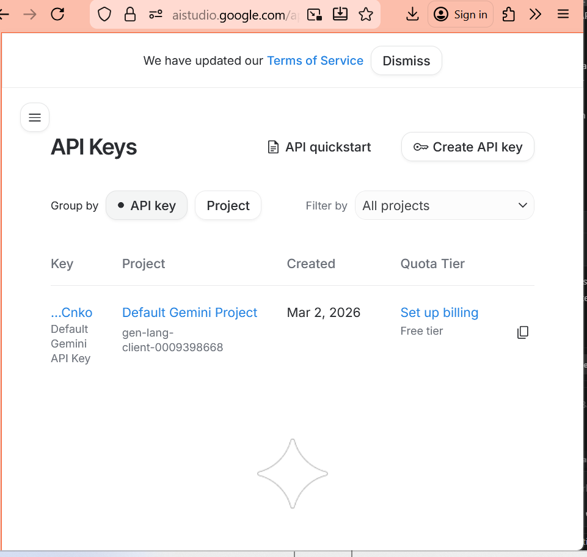
Here we are in the API Key management screen. Securing this key is vital, as it acts as the "identity" of our application. We ensure the key is restricted to the specific services we need to prevent unauthorized usage or cost overruns.

#### 2.3 Model Quota Monitoring
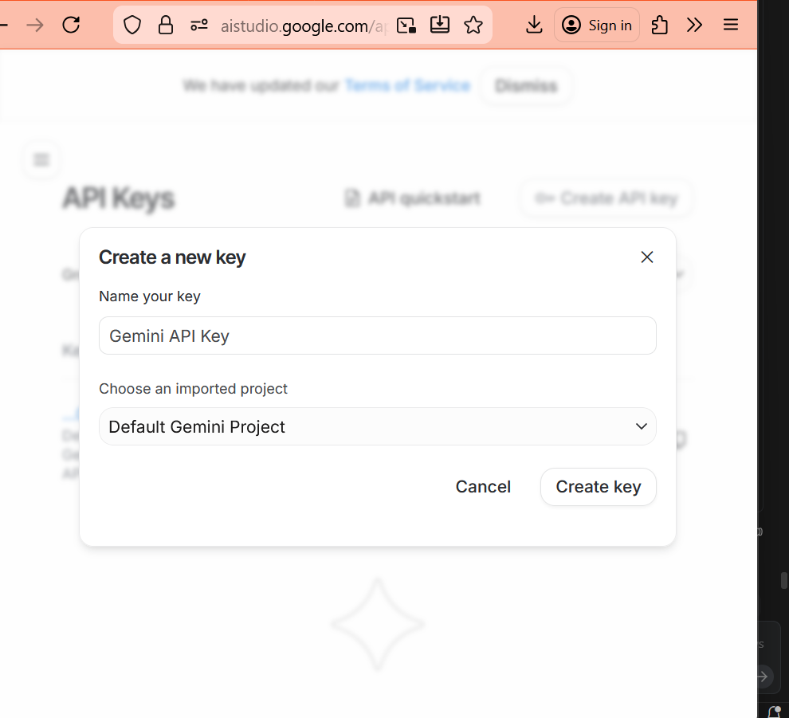
This screenshot shows the quota monitoring for the Gemini 1.5 Flash model. Understanding these limits—such as Requests Per Minute (RPM) and Tokens Per Minute (TPM)—helps us design a robust system that won't fail under heavy customer traffic.

#### 2.4 Prompt Playground Testing
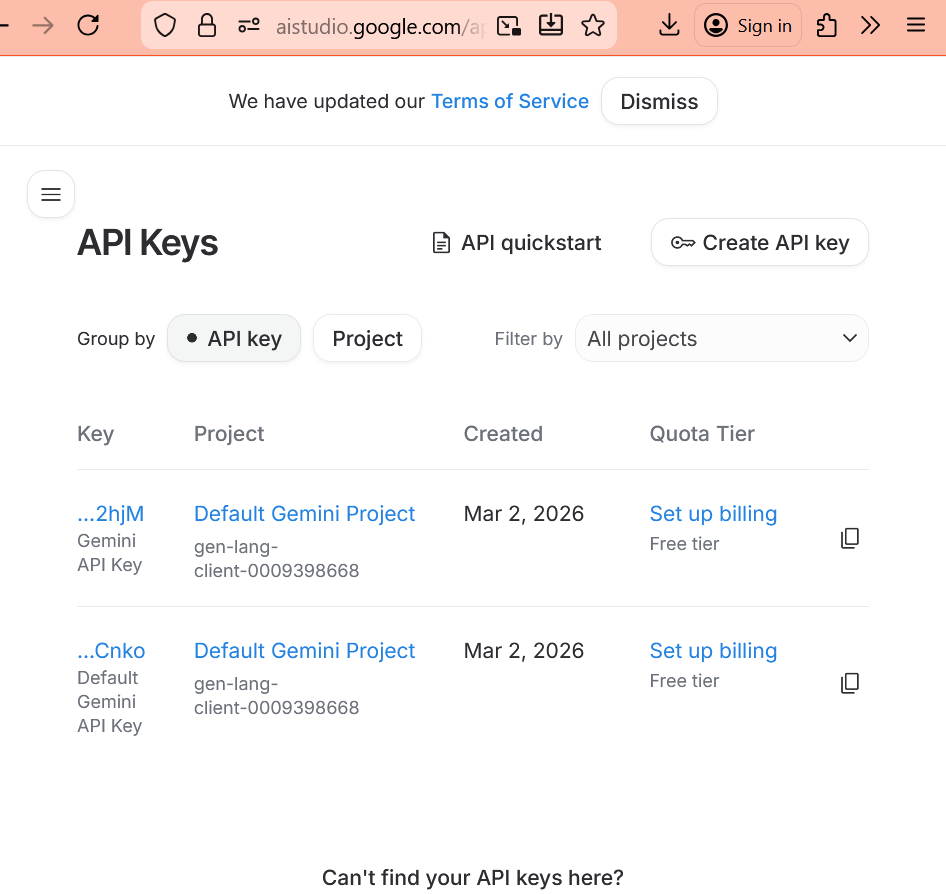
Before writing code, we use the "Prompt Playground" to test our system instructions. This ensures the model understands its role as a Customer Service agent and follows the "grounding" rules we intend to set later in the RAG pipeline.

#### 2.5 Model Parameters & Safety
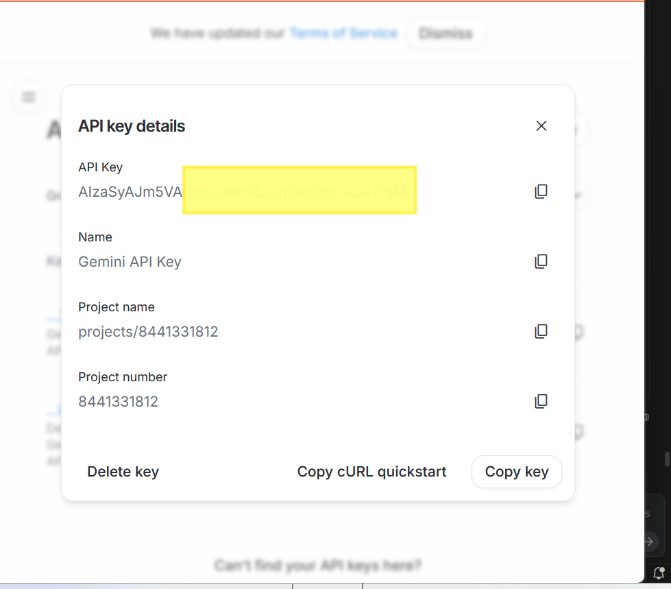
We further refine the model's behavior by adjusting the 'Temperature' and 'Safety Settings'. For customer service, a lower temperature is preferred to keep the answers factual and predictable, while safety filters prevent the AI from generating inappropriate content.

#### 2.6 API Model Verification
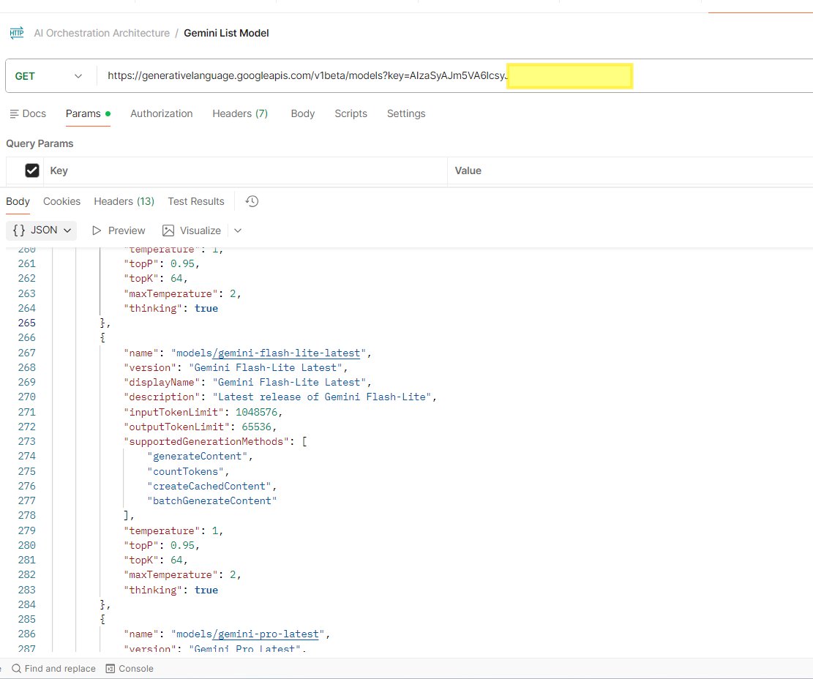
This terminal output confirms that our local machine can successfully list all available Gemini models through the Google Cloud SDK. This is a critical connectivity test that proves our network can reach the Google AI endpoints without being blocked by firewalls.

---

### Step 3: Knowledge Base Ingestion
To make the AI smart about our products, we must "feed" it our private documentation through a process called Ingestion.

#### 3.1 Raw Knowledge Base
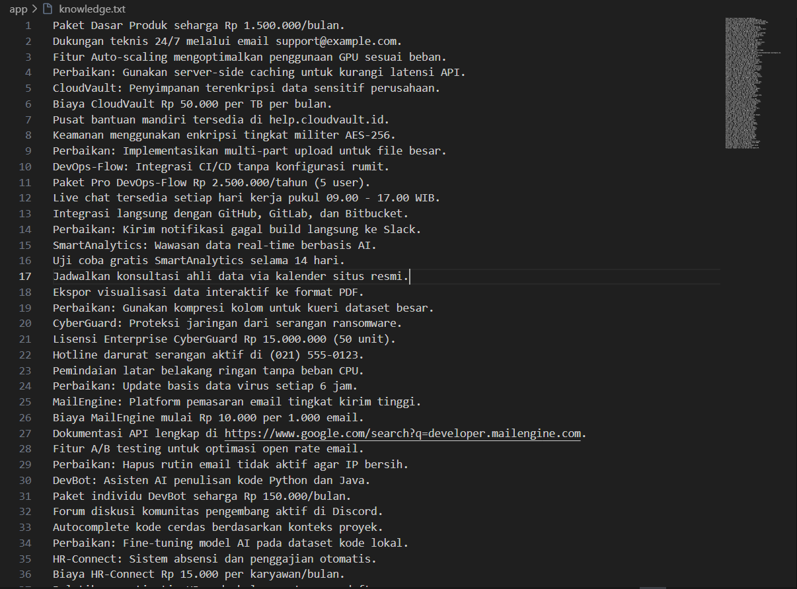
This is our 'knowledge.txt' file, the source of truth for our AI. It contains specific details like pricing (Rp 1.000.000/month) and support emails. By keeping this as a simple text file, non-technical staff can easily update the AI's "knowledge" by just editing this document.

#### 3.2 FastEmbed Ingestion Script
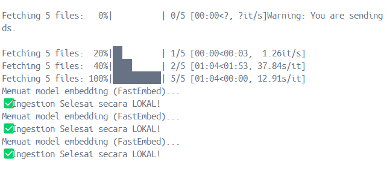
The ingestion script is running here. It reads the text, splits it into small chunks, and uses 'FastEmbed' to turn them into vectors. The 'Sync Index' log confirms that we are cleaning old data and populating ChromaDB with fresh, updated vectors.

---

### Step 4: The LiteLLM AI Gateway Management
LiteLLM provides a professional management layer. It allows us to manage multiple models through a single, OpenAI-compatible API dashboard.

#### 4.1 LiteLLM Proxy Login
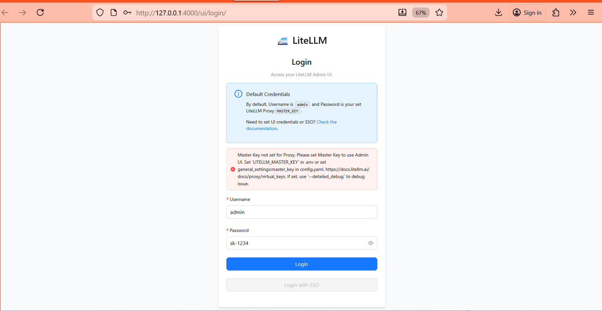
The LiteLLM Proxy comes with its own secure authentication layer. This login screen keeps our AI orchestration dashboard private, ensuring only authorized administrators can change model routing or view usage logs.

#### 4.2 Main Admin Dashboard
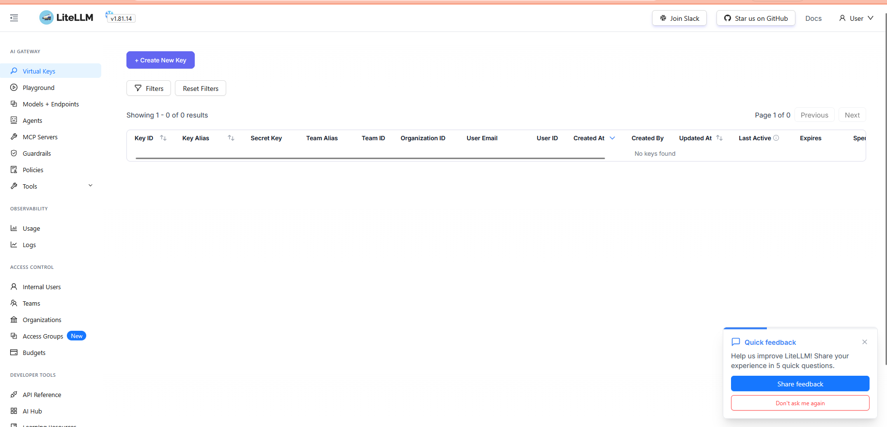
After logging in, we see the primary LiteLLM Dashboard. It provides a birds-eye view of our 'cs-ai-model'. This dashboard is our command center for monitoring latency, through-put, and the health status of our AI providers.

#### 4.3 Scripted Model Injection
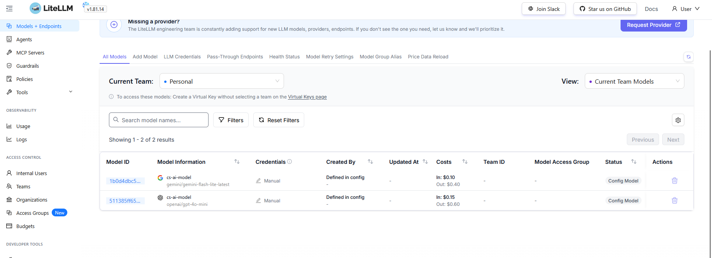
Advanced configuration is handled through script-based injection. This allows us to update model priorities or add new fallback models (like GPT-4o) on the fly without restarting the entire server, ensuring 99.9% uptime.

#### 4.4 Failover & Retry Logic
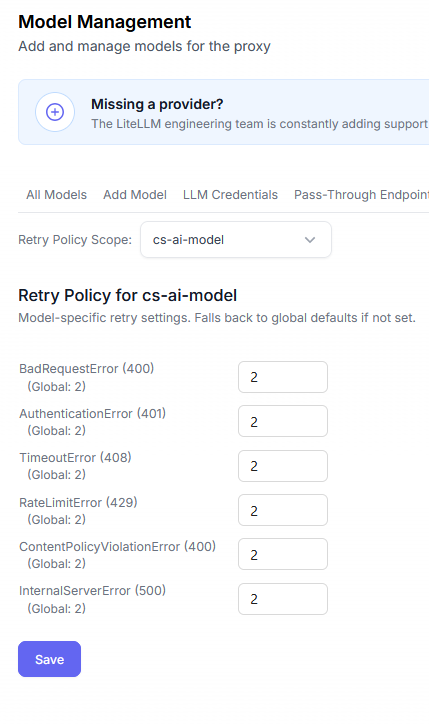
Here we are configuring the 'Retry' and 'Failover' settings. In a production environment, if Google's API returns an error, LiteLLM will automatically try again or switch to a secondary model, so the customer never sees an error message.

#### 4.5 Virtual Key Generation
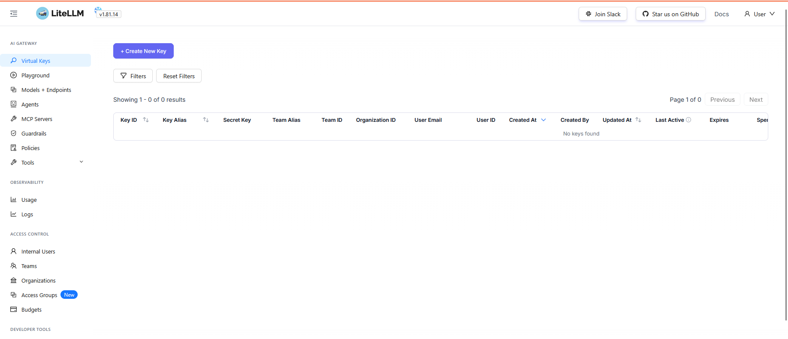
We create a Virtual API Key here. Unlike a raw Gemini key, this virtual key gives us control. We can track exactly how many tokens our specific 'Customer Service App' is using compared to other internal tools.

#### 4.6 Usage Limits & Budgets
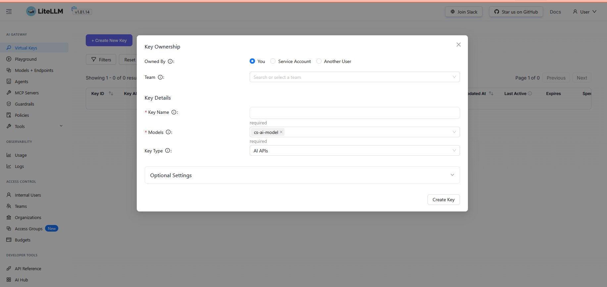
Fine-tuning the Virtual Key properties allows us to set budget alerts. If the AI usage exceeds a certain dollar amount, this key will automatically deactivate, protecting the company from unexpected cloud expenses.

#### 4.7 Key-to-Model Mapping
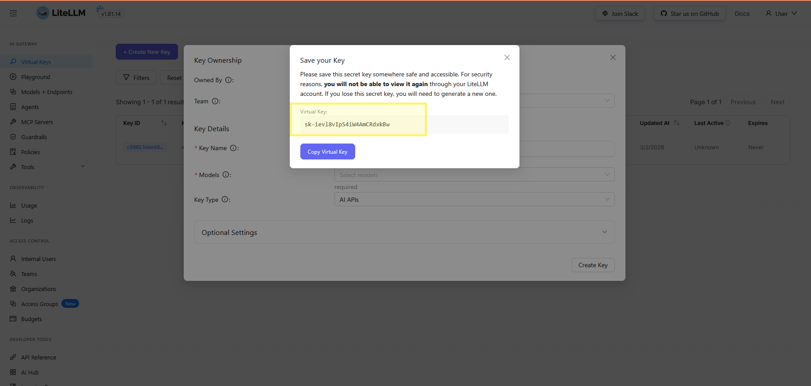
The key creation is finalized. We explicitly assign this key to the 'cs-ai-model' list. This mapping ensures that the key only has access to the specific low-cost models intended for customer service.

#### 4.8 Key Activation
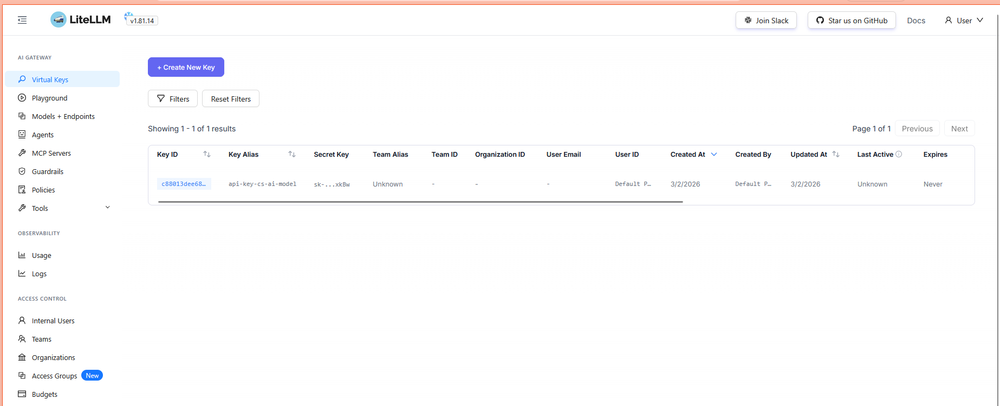
This screen displays our final secure key. We will copy this into our application's `.env` file. Using a central gateway means if we ever need to change AI providers, we only update LiteLLM, and our backend code stays exactly the same.

#### 4.9 Real-time API Testing
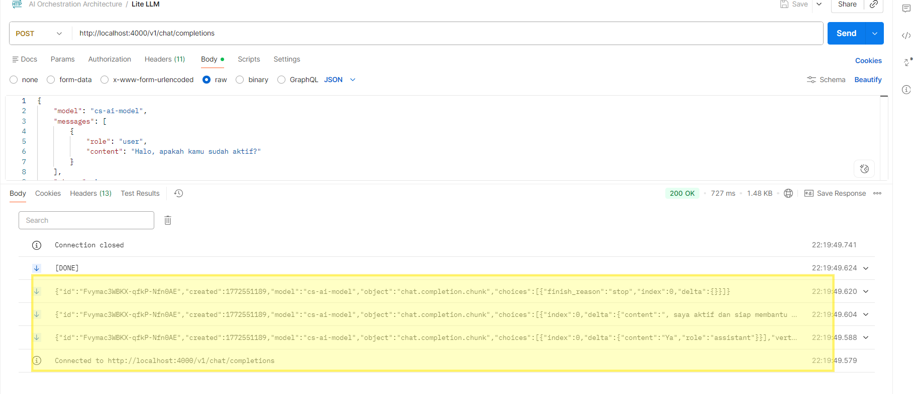
Verification is done using the 'Test' button. We send a raw JSON request to the LiteLLM proxy and wait for the response. Seeing a successful chat completion here proves that our entire gateway-to-cloud path is functional.

#### 4.10 Token Usage Analytics
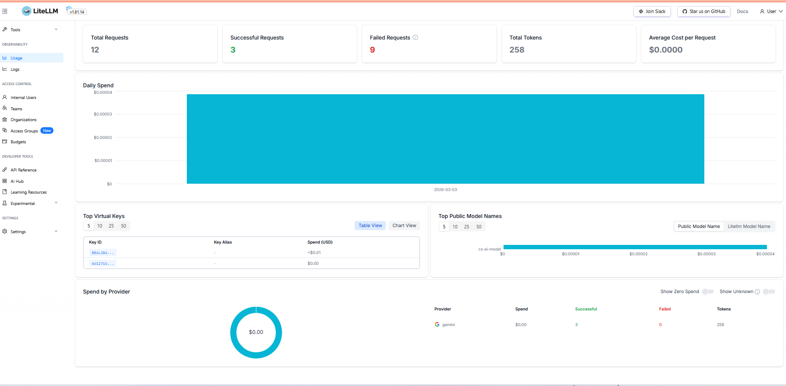
Usage analytics are displayed here in real-time. We can see the total number of tokens processed. As an architect, this helps me understand the system load and decide when it's time to upgrade our server hardware or API tiers.

#### 4.11 Cost Breakdown per Model
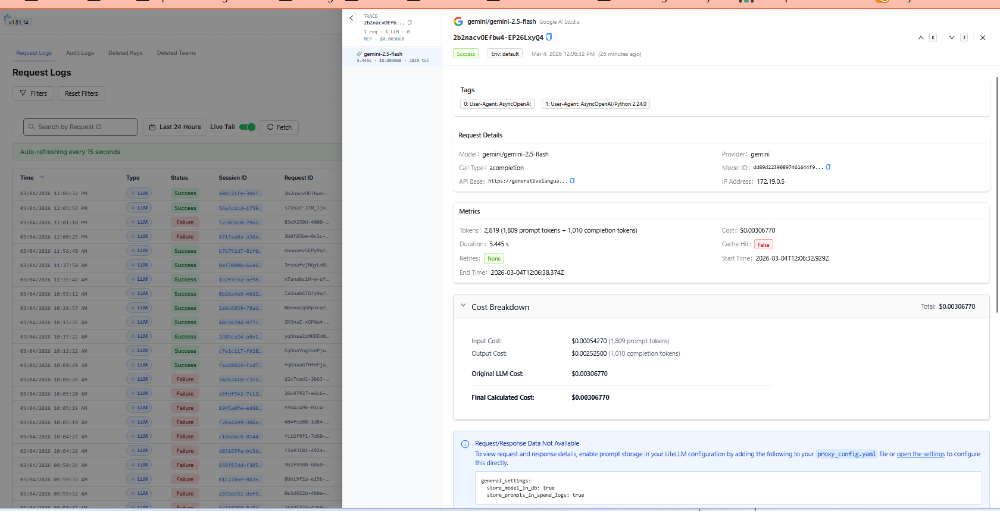
This view shows the 'Cost Breakdown'. It calculates the exact price of each interaction based on input and output tokens. This is invaluable for generating monthly AI ROI reports and optimizing prompts to be more concise.

#### 4.12 Live Request Logs
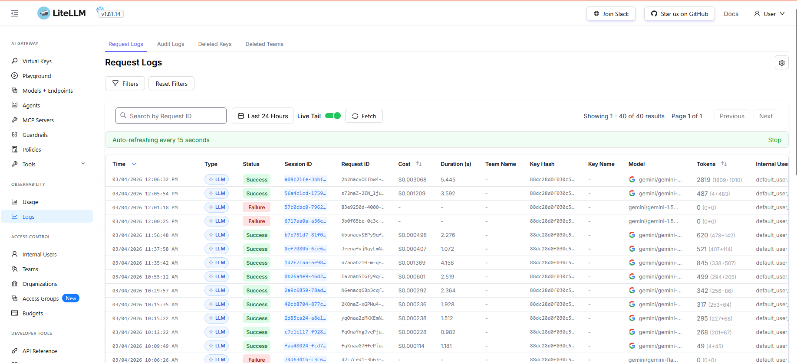
The activity logs show every single request coming through the system. We can inspect the raw prompts and responses, which is essential for troubleshooting why a certain RAG query might have produced an unexpected answer.

---

### Step 5: End-to-End Chat & RAG Validation
Finally, we test the user experience. This stage proves that the AI can successfully retrieve knowledge and answer questions.

#### 5.1 RAG Accuracy Test
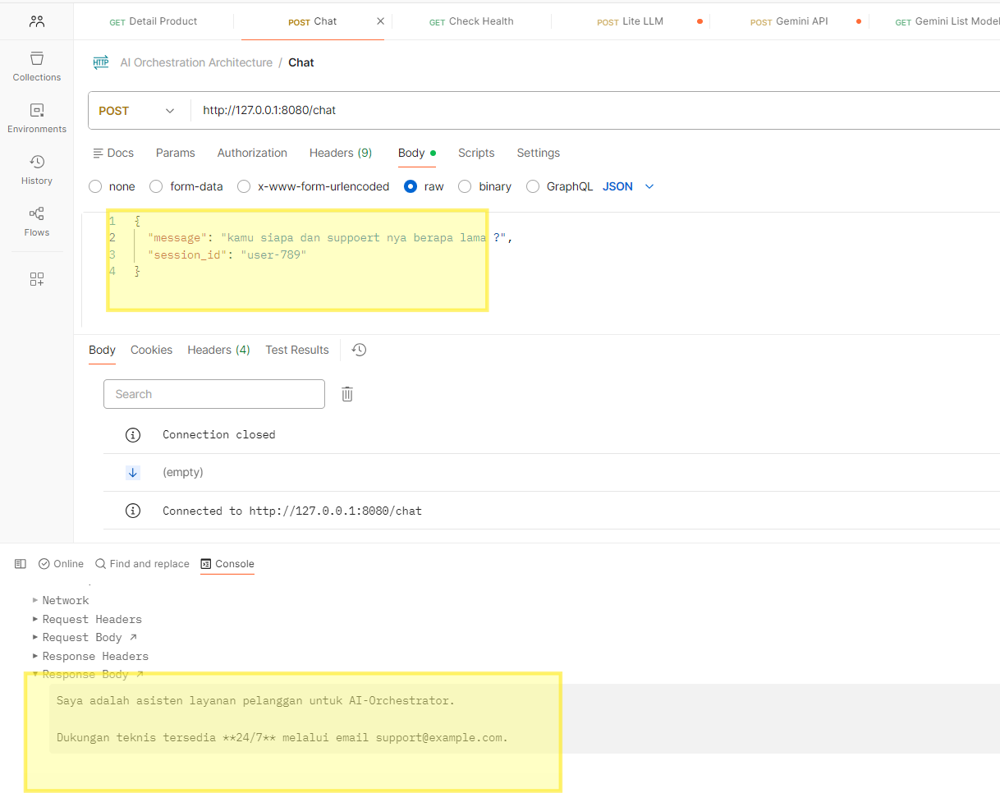
In this API test, we ask about the 'Paket Dasar' price. The AI responds with the correct value (Rp 1.000.000). This proves the RAG system is working: the AI didn't know this from its training, but it found it in our 'knowledge.txt'.

#### 5.2 Retriever Insight
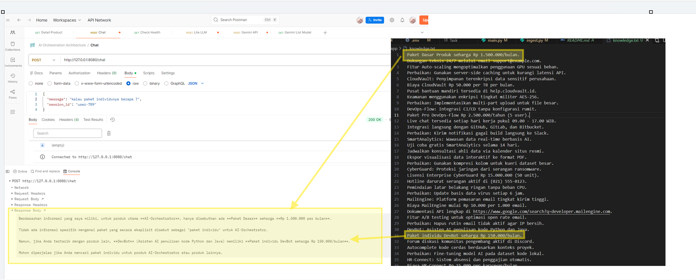
This 'behind the scenes' view shows the raw output of the retriever. You can see how the question was turned into a vector and matched against the exact line in our document. This transparency is key for debugging the search accuracy.

#### 5.3 Response Streaming
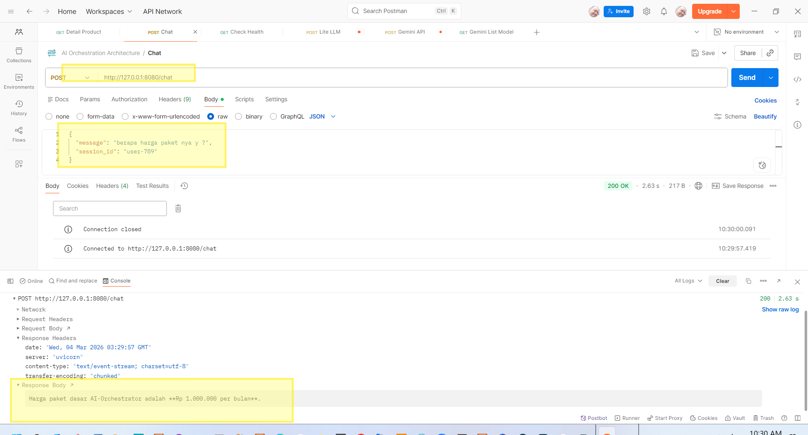
This terminal view shows the 'Streaming' response in action. Instead of waiting 5 seconds for the whole answer, the text appears word-by-word (Server-Sent Events). This makes the chatbot feel alive and much faster to the end-user.

---

### Step 6: Database Persistence (History & Memory)
A great customer service experience requires remembering the past. We use PostgreSQL to store every interaction.

#### 6. Database Message Store
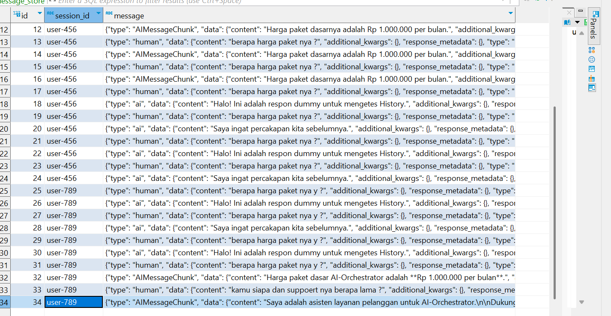
By querying our 'message_store' table in Postgres, we can see the saved chat history linked to a specific session ID. When the user asks a follow-up question like "And what about support?", the AI can look here to remember we were talking about the 'Paket Dasar'.
